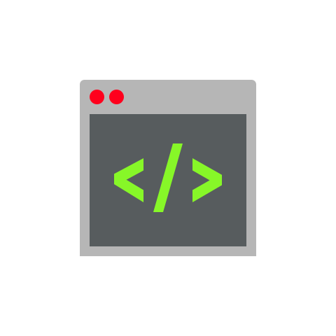

<p align="center">
  
</p>

<h1 align="center">DevSpawn: AI-Driven Code Auto-Generation Platform</h1>
<p align="center">
  <a href="http://www.devspawn.pw" target="_blank">Official Website</a> •
  <a href="https://x.com/devspawnWeb3" target="_blank">Twitter</a>
</p>

## 🚀 Vision

Democratize software development, enabling anyone to easily transform ideas into runnable software.

## 💡 Core Values

- AI One-Click Code Generation
- Lower Development Barriers
- Multi-Language Support
- Decentralized Development Ecosystem

## 🔍 Technical Solution

DevSpawn utilizes advanced AI models to convert natural language into highly optimized code across multiple programming languages. The platform understands context, designs intelligent architecture, and even provides performance optimization suggestions.

### Code Generation Example

```javascript
// Natural language input: "Create a function to sort an array of objects by a property"
// DevSpawn AI generates:

function sortArrayByProperty(array, property) {
  if (!Array.isArray(array) || !property) {
    throw new Error('Invalid arguments');
  }
  
  return [...array].sort((a, b) => {
    if (a[property] < b[property]) return -1;
    if (a[property] > b[property]) return 1;
    return 0;
  });
}
```

## 💰 Token Economics

### $DVSN Token

- **Total Supply**: 1 billion tokens
- **Launch Platform**: PUMP.FUN
- **Launch Principle**: 100% Fair Launch
- **Distribution**: Zero pre-sale, zero institutional quota

### Token Use Cases

- Platform access rights
- Code generation credits (each generation costs 10 $DVSN)
- Community governance
- Advanced feature unlocking

## 💻 Getting Started

### Prerequisites
- Node.js (v14 or higher)
- npm or yarn

### Installation
1. Clone the repository
```
git clone https://github.com/your-username/devspawn.git
cd devspawn
```

2. Install dependencies
```
npm install
```

3. Start the development server
```
npm start
```

### Usage
1. Select your desired programming language
2. Enter a description of the code you need 
3. Click "Generate Code"
4. View and copy the generated code

## 🔧 Core Implementation

```javascript
// Excerpt from our AI code generation service
export const generateCode = async (prompt, language) => {
  // Advanced AI model processing
  const modelResponse = await aiModelProcessor.analyze({
    prompt,
    language,
    contextAwareness: true,
    securityCheck: true,
    performanceOptimization: true
  });
  
  // Intelligent code structure formation
  return modelResponse.generateOptimizedCode();
};
```

## 🛣️ Development Roadmap

- **Phase 1**: Core AI model development
- **Phase 2**: Public beta with community testing
- **Phase 3**: Ecosystem expansion and integration

## 🤝 Community & Governance

DevSpawn is built around a strong community of developers and users. Token holders can participate in platform governance decisions through our decentralized voting system.

## 📬 Contact

- **Website**: [http://www.devspawn.pw](http://www.devspawn.pw)
- **Twitter**: [@devspawnWeb3](https://x.com/devspawnWeb3)

## Contributing
Contributions are welcome! Please feel free to submit a Pull Request.

## License
This project is licensed under the MIT License - see the LICENSE file for details.

---

<p align="center">Join the Code Revolution, Unleash Creativity!</p> 